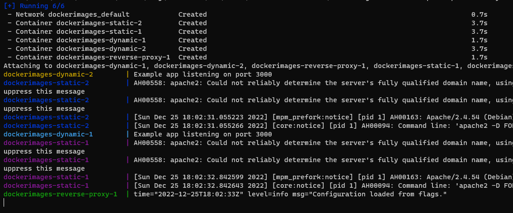
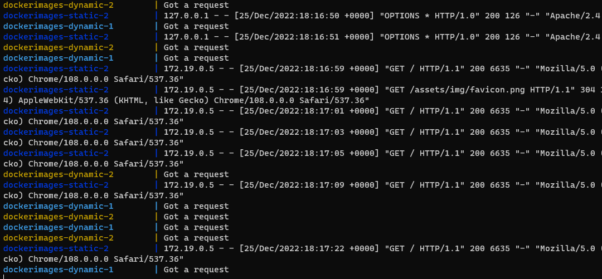
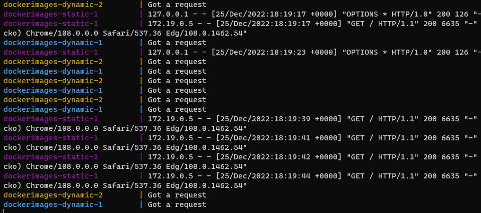

HTTP Infra
==========

Célestin Piccin & Kévin Jorand

------------

## Introduction
Le but de ce laboratoire est de découvrir et se familiariser avec différents outils afin de construire une infrastructure web complète.

Le résultat final contiendra *(minimum)* deux serveurs HTTP (un dynamique et un statique), un reverse-proxy et un manager de containers Docker.

### Note
Les différentes infos données dans les "steps" ... ne sont parfois valable qu'à cette étape puisque certaines étapes ont nécessité l'édition des étapes précédentes ... 

### Note 2
Certaines notes ont été prises au fur et à mesure des steps, mais la documentation (y. compris pour chaque step) valide est bien celle de la branche `main`. Cette denière contient aussi la dernière version du reste du code (step 6).

## Step 1: Static HTTP server with apache httpd

Les fichiers de configuration apache se trouvent dans le dossier ```/etc/apache2```. Dans notre cas nous n'avons pas touché aux fichiers de configuration car la config par défaut d'apache est suffisante.

Pour accéder à un container en exécution : ```docker exec -it <nom container> /bin/bash```

Ensuite on peut naviguer dans l'arborescence du système en utilisant la commande ```cd```.

Le Dockerfile utilise l'image php 8.1 avec apache (```php:8.1-apache```). Après quelques essais sur le contenu du labo, nous n'avons rencontré aucun problème à l'utilisation de php 8.1. Puisque nous n'avons éprouvé aucune des difficultés qu'on nous avait prédites, nous avons ainsi pris le parti d'utiliser la dernière version stable d'alors. Cela nous a semblé être une meilleure chose puisque cela retarde l'obsolescence de notre projet. Nous remarquons de plus que la page de template que nous utilisons n'est pas en `php` ... elle n'est donc même pas "process" par `PHP` avant d'être servie au client. 

On copie ensuite notre site (https://bootstrapmade.com/gp-free-multipurpose-html-bootstrap-template/) dans le dossier ```/var/www/html/``` de l'image.

Deux scripts sont disponibles:
 - ```build.ps1``` :  crée notre image à partir du Dockerfile 
 - ```run.ps1``` : lance un nouveau container à partir de l'image créée par build.ps1

Pour faire tourner l'application, il suffit d'avoir Docker qui fonctionne et installé et le contenu de notre repo. Un simple ```.\build.ps1``` depuis le répertoire où il se trouve suivi d'un ```.\run.ps1``` permet alors de lancer le nécessaire. A noter encore qu'il faut que le port `80` soit disponible sur le PC en question.

Si un container est en exécution : ```loaclhost:80``` (ou simplement ```loaclhost```, `80` étant le port par défaut pour le contenu web) pour accéder a notre site web.

## Step 2: Dynamic HTTP server with express.js

Notre serveur HTTP dynamique utilise express.js et renvoie la météo de différentes villes (plus ou moins fantaisistes) au client au format JSON.

Le JSON renvoyé contient différentes informations, notamment le nom de la ville, le jour et la température.

### Js
Les commandes suivantes ont été utiles pour cette étape:

 - ```npm init``` => pour créer une nouvelle application node.js

 - ```npm install --save chance``` => pour ajouter le module chance à l'application

 - ```npm install --save express``` => pour ajouter le module express.js à l'application

Le code se trouve dans le fichier ```index.js```. Le serveur renvoie au client le résultat de notre fonction ```getWeather()``` à chaque fois qu'il reçoit une requête à l'URL racine sur le port `3000` (port standard pour les applications express.js).

### Docker
Le Dockerfile utilise l'image node version 18 (```node:18``` qui est la version `LTS` actuelle). On copie ensuite notre application dans ```/opt/app``` puis on utilise l'instruction CMD (```CMD ["node", "/opt/app/index.js"]```) qui permet d'exécuter notre fichier ```index.js``` à chaque fois qu'un container est créé à partir de l'image.

De la même manière que pour l'étape 1, deux scripts sont disponibles : 
 - ```build.ps1``` :  crée notre image à partir du Dockerfile 
 - ```run.ps1``` : lance un nouveau container à partir de l'image créée par build.ps1

Si un container est en exécution (```.\build.ps1``` suivi de ```.\run.ps1``` dans le répertoir qui les contient [avec le contenu de notre repo], pour autant que le port `3000` était préaéablement libre sur le PC) on accède au site web dynamique à partir de ```localhost:3000```.

### Note
Le dossier `node_modules` n'a pas été `push` sur Github pour respecter les standards et car il est relativement volumineux. ~~De ce fait avant de `build` notre image, il faut générer le dossier en local. Pour ce faire, il faut utiliser la commande ```npm i``` dans le dossier ```/src/```  (là ou se trouvent ```package.json```).~~

**Nous avons pris le parti de générer le dosier `node_modules` (et le `package-lock.json` généré au ```npm i```) directement dans l'image lors de sa création. Cela offre l'avantage d'avoir ainsi directement les fichiers de librairies adaptés pour le bon environnement et permet aussi d'avoir le tout qui est fait par le `docker build`.**

## Step 3: Docker compose to build the infrastructure

### Note
Ayant un doublé de `step3`, nous les avons faits ensembles, considérant qu'ils allaient de fait ensembles ... Ils sont donc documentés en commun ici.

Les instructions sont stockées dans ```docker-compose.yml```

Pour démarrer l'infrastructure utiliser : ```docker compose up``` ou le script ```run.ps1``` fourni.

Le fichier docker-compose.yml permet de démarrer 3 containers/3 services de manière très simple et rapide. 

Les 3 services sont:
 - reverse-proxy => un container utilisant Traefik pour faire du reverse-proxy (Apache n'étant plus recommandé au profit de ce dernier)
 - static => un container avec notre serveur HTTP static (apache-php)
 - dynamic => un container avec notre serveur HTTP dynamique (express.js)

Le label suivant a été ajouté pour le service static : ```"traefik.http.routers.static.rule=Host(`localhost`)"```.

Ce label est utilisé par Traefik pour rediriger le client sur le serveur static lorsqu'il accède à l'URL ```localhost```.

Le label suivant a été ajouté pour le service dynamic : 
```"traefik.http.routers.dynamic.rule=(Host(`localhost`) && PathPrefix(`/api`))"```.

De la même manière, ce label permet à Traefik de rediriger le client sur le serveur dynamique lorsque celui-ci accède à l'URL ```localhost/api```.

On accède à l'UI de gestion de Traefik par le port 8080 (```localhost:8080```).

### Note 
Le fichier index.js a dû être modifié pour cette étape pour que le serveur dynamique réponde lorsque le client demande la ressource ```/api``` et plus ```/``` tout court. De plus nous avons aussi ajouté un ```console.log()```, ce qui est utile pour l'étape `3a` pour savoir facilement quelle instance du serveur dynamique répond au client.

## Step 3a: Dynamic cluster management

Pour lancer plusieurs instances des 2 serveurs webs il suffit d'utiliser la commande suivante : ```docker compose up --scale dynamic=2 --scale static=2```. 

Cette commande utilise l'option ```--scale``` pour démarrer 2 serveurs webs statiques et 2 serveurs webs dynamiques. On a donc 5 containers au total qui sont créés à partir de cette commande.

On notera aussi que pour le service static et dynamic on ne précise pas le ```HOST_PORT``` dans la section ```ports:```. Un port aléatoire est donc choisi par le système. Ceci est nécessaire car par exemple si on précise le ```HOST_PORT``` et on lance 2 instances du service static une erreur serait générée car on aurait 2 containers utilisant le même ```HOST_PORT```.

## Step 4: AJAX requests

Pour la réalisation / développement de cette étape, on choisi l'option avec montage de volume pour l'édition en live. On a aussi choisi l'utilisation de la `Fetch API` plustôt que de `jQuery`. Il n'y a pas eu grand-chose à configurer ... plutôt comprendre / apprendre / appliquer. Cela se voit relativement bien par les commits assez peu volumineux.

Nous avons toutefois profité de cette étape pour "nettoyer" un peu la page qui était servie statiquement (qui était un "bête" template dont les sources sont mentionnées plus haut). On a alors notre partie de page "météo" (contenant le contenu dynamique du second serveur) qui est affiché dynamiquement ... et qui est référenceé plusieurs fosi sur la page.

On peut construire le tout et tester avec la commande : 
```ps
.\buildAllAndRunScale.ps1 -dynamicScale 3 -staticScale 4
```
Qui va lancer 3 instances dynamiques et 4 instances statiques.

## Note

Suite aux diverses modifications / améliorations, la nécessité de "build" avant de lancer notre `docker compose up` a été éliminée. On peut ainsi utiliser simplement:
```ps
.\runScale.ps1 -dynamicScale 3 -staticScale 4
```

## Step 5 : Load balancing: round-robin and sticky sessions

Afin d'utiliser l'option sticky session, on ajoute les 2 labels suivants dans le ```docker-compose.yml``` pour le service static.

```
- "traefik.http.services.static.loadbalancer.sticky=true"
- "traefik.http.services.static.loadbalancer.sticky.cookie.name=StickyCookie"
```

On remarque que Traefik utilise des cookies pour gérer des sticky sessions.

### Procédure de validation
La validation peut se faire en lançant plusieurs instances des serveurs webs, soit en faisant un docker compose up et en utilisant l'option ```--scale``` soit en utilisant les scripts fournis. Attention tout de même que ```docker compose up``` ne **rebuild** PAS les images, si les images doivent être rebuild utiliser la commande ```docker compose build``` avant de faire le ```docker compose up```, ou alternativement la commande ```docker compose up --build```.

Après le lancement, on doit voir dans la console un résultat similaire à ceci :

Dans l'image ci-dessus, nous avons démarré 2 serveurs dynamiques et 2 serveurs statiques ainsi que le reverse-proxy.

Si on se rend sur le site `static` et qu'on fait plusieurs refresh, on peut voir dans la console que c'est toujours le même container qui répond au client (serveur `static-2` en bleu foncé). 



Si maintenant on stoppe le container qui répondait au client et qu'on refait un refresh de la page on voit que le load balancer fait bien son travail car c'est une autre instance du serveur statique qui répond au client (serveur `static-1` en violet). Par la même occasion on remarque aussi que les instances dynamiques continuent bien à utiliser du round-robin (alternance entre `dynamic-1` en bleu clair et `dynamic-2` en jaune).



## Step 6: Management UI

Pour cette étape nous avons choisi une solution déjà existante trouvée sur Internet : `Portainer`.

Portainer est une plateforme de gestion de containers très populaire qui permet de déployer, configurer et dépanner des containers de manière simple et rapide. De plus Portainer n'est pas limité à Docker seulement, il peut aussi gérer d'autres environnements comme Kubernetes ou Nomad.

Nous avons ajouté un service portainer dans le ```docker-compose.yml``` en utilisant l'image portainer/portainer.

On accède à l'UI de portainer en utilisant le port 9000 (```localhost:9000```) depuis un navigateur.

On a utilisé le paramètre suivant :
```
    command: --admin-password '$$2y$$05$$bHa3AA9lWXhIZVM/JptlMua6HdA3s/8x0nhqKPAX8WGL.mNjxdwlK'
```
Pour paramétrer le mot de passe admin à la création de l'image. Sinon il est demandé au premier accès à la page d'en créer un. Cela donne ainsi la possibilité à quiconque accédant à la page avant nous de pouvoir avoir l'accès complet à notre système ! [BAD]. 

La chaine correspond à un hash du mot de passe `adminpassword`. On note que cela permet en plus de nous afranchir des limitations (min 12 caractères) de mot de passe de l'interface graphique (mais si l'on en choisit un de longueur inférieure, alors il nous est demandé de le changer à la première connexion). La commande utilisée pour la générer est :
```ps1
docker run --rm httpd:2.4-alpine htpasswd -nbB admin 'adminpassword'
```
Qui nous a alors retourné :
```
admin:$2y$05$bHa3AA9lWXhIZVM/JptlMua6HdA3s/8x0nhqKPAX8WGL.mNjxdwlK
```
On ne prend pas la première partie qui correspond au nom d'utilisateur (`admin`, utilisé pour générer le hash), mais uniquement la seconde, qui correspond bien au hash. On doit de plus échapper les `$` par un second `$`, ce qui conduit à la chaine ci-dessus.

Il va sans dire que c'est un très mauvais mot de passe et que dans un cas réel, il ne serait pas inclus "tel quel" en clair dans la documentation, mais dans le cadre de ce labortoire, cela convient bien pour démontrer la fonctionnalité.

Cet UI de gestion permet de répondre aux différentes exigences de l'étape 6. On peut notamment, depuis l'UI de portainer, voir les différents containers en exécution, arrêter/démarrer un/des container(s) ainsi qu'ajouter ou enlever des instances d'un container.
